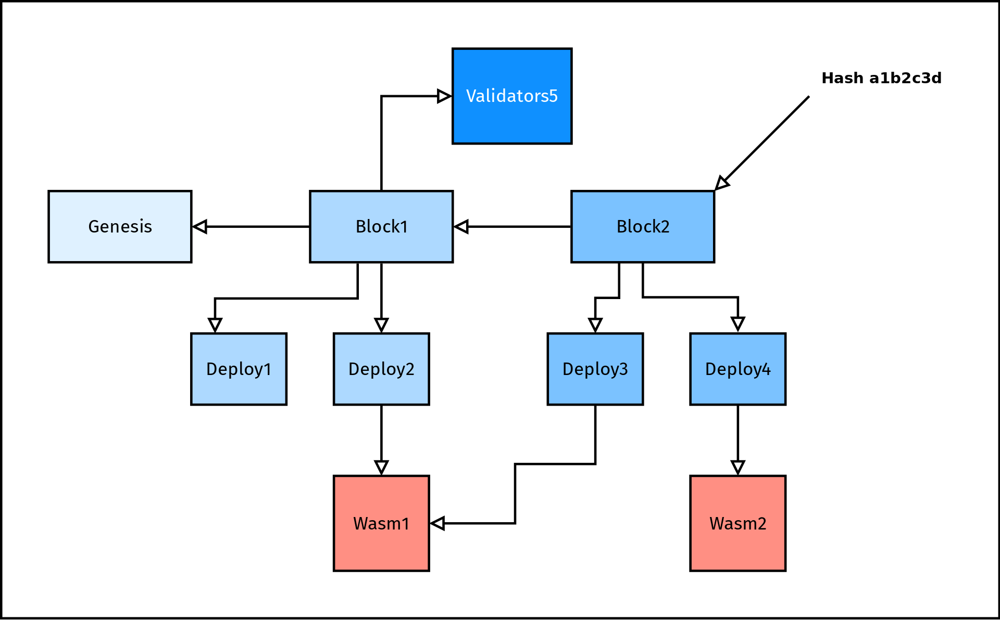

# Hash-indexed object store

## Summary

[summary]: #summary

CEP PR: [casperlabs/ceps#0003](https://github.com/casperlabs/ceps/pull/0003)

There are a variety of _objects_ defined in various parts of the node's code base, such as Deploys, Wasm blobs, Blocks, and DAG nodes. This proposal recommends standardizing all such objects using a [Git](https://git-scm.com)-inspired object model with the intent of unifying and simplifying the platform's networking, gossiping, retrieval, check pointing, and storage logic.

## Motivation

[motivation]: #motivation

A good motivating example for this change is the synchronization/rejoining process: Nodes attempting to join an existing network with knowledge of a recent, trusted block hash must accumulate sufficient data to "catch up" to the network's current state. The current default model requires a new node to start from genesis and attempt to catch up by acquiring and executing each block in order; which becomes increasingly problematic as the block height of the network increases.

This approach also requires separate instances of the gossiper and fetcher components for each type involved (Block and Deploy at a minimum, perhaps also DAG nodes). The storage component needs to namespace according to each type and component developers need to remember which effect to call for each type, while the core logic remains the same for all such operations.

This CEP proposes a unified, Git-inspired architecture for most data related to the node. In addition to improved ease of use for component developers, this approach also simplifies snapshotting and data shipping, and lend itself more easily to external caching (see [Future possibilities](#future-possibilities)).

## Guide-level explanation

[guide-level-explanation]: #guide-level-explanation

(It is recommended to read the [prior art](#prior-art) section beforehand)

Every *object* that our node handles, e.g. a Block or Deploy, has common properties, namely:

* It can be serialized to binary storage.
* It has a unique identifying hash that depends solely on its contents. For example a Block may reference a number of Deploys by hash, which in turn may reference Wasm blobs by hash.

We propose to unify these objects into a single type (or alternative trait), replacing the IO and network-related components with instances that work with generic objects only.

These objects will form a directed, acyclic graph as a result, with edges expressed by hashes. Resources can be referred to multiple times to deduplicate them directly in the graph structure, although this property prevents the graph from being a proper tree rooted in the latest block.

Below is a **simplified** example, in which we look at a fictional blockchain with three blocks (Gensesis, Block1, Block2), two of which containing two Deploys each. Some of these Deploys refer to Wasm-Blocks, one of which is shared. Block1 also happens to be a switch block, containing a list of validators for era 5:



Here the hash of Block2 (`a1b2c3d`) is enough to retrieve Block2, from which all other data can be reached. The Wasm1 blob that is shared between Deploy2 and Deploy3 is what prevents this graph from being a tree.

_NOTE: This example does not show the consensus dag or global state root hash, see below for more information_

### Serialization

Every object recognized by the platform can trivially be serialized, prefixed with a type tag, and sent across the network or stored. The tag should be kept short, one byte should be plenty to cover all of our usecases (we will reserve one value for future expansion if necessary).

### Hashing

Object hashes are always Blake2b256 hashes, as these are already in use by the execution engine. It is imperative that we standardize on one kind of hash for all objects, even though the actual hash algorithm is less important (see also: <https://github.com/CasperLabs/ceps/pull/8>).

The hash value is derived solely from the serialized representation of the object, including its tag. This has the advantage that hashes can be checked without deserializing the object, even progressively while downloading it from a peer if necessary.

It also allows storage and hash verification by other tools that are unaware of any of the business logic.

### Object references

Any properly typed object in memory provides a method for iterating over all of its *dependencies*. In graph terms this is an iterator over all outgoing edges.

With this functionality, the logic of fetching dependent objects is moved out of the business logic components and into the fetcher. Verifying all referenced dependencies are available is subsumed into the fetcher as well.

_NOTE: this would render the current block validator component obsolete._

Other components can decide if they want to fetch or fetch recursive, specifying a peer that is required to provide the specific missing parts when asked.

Put into "pseudo-git" representation, this fictional format would look like this

```text
block
era 123
parent 2a691f09b09c62fb99fd1b52cfdd0ffecb68871a9af40ab48662b3c943a87a82
deploy a4ddaa0f887c31af66fa74d2bcabfde7504ce2d044315f2d9e0691b89a33f135
deploy f70a43aa0735e622f419e4456d4105a18b75ae194a7e97a73acbc4065a33d4a2
signature d042c9d14a1097344437735b84052ea997c42ba8d4e54de034be3d19d92b0a13
...
```

```text
deploy
gas-limit 0x32312
code 8257512c1a16fbc4ad536d1603d6c8fdfe9f05a1b3d537e0b17770e0de01a43b
...
```

`code` refers to another object that contains the Wasm code.

## Chain vs consensus DAG

The term *DAG* is overloaded in this CEP, we refer to the DAG of the consensus algorithm als the *consensus DAG*, while using the term *chain DAG* for the graph structure that consists of Blocks, Deploys and similar structures.

The consensus DAG is structure parallel to the chain DAG, while there may be "soft" references between the two, they are not made hard dependencies to avoid having to preserve the full consensus DAG for a specific era forever

## Refs

In this example given earlier in this section, a specific hash was designated as the starting point (`a1b2c3d` in the figure). Similar to Git references (tags/branches), we introduce these *refs*, which map a name to a hash.

A good example is for a ref is `refs/trusted`, which refers to the latest block that the node considers as finalized and valid, i.e. trustworthy. Should the node crash, it will resume operation by ensuring it has all the dependencies of `refs/trusted` and checking whether it is still inside the unbonding period (further details on node rejoining are out of scope for this CEP, see [CEP5](https://github.com/CasperLabs/ceps/pull/5) instead).

Building on this idea, `refs/latest` can refer to the latest block created known by the node, which may be newer than `refs/trusted`.

The immediate gain is that different kinds of information retrieval can be standardized as well by asking other nodes for refs instead of adding custom network message. For example, should a node want to catch up with the network, it requests `refs/trusted` from another node through a generic "retrieve ref" interface as opposed to a specialized "retrieve latest block hash".

## Storage

The new object store component is just a large key-value store, which stores a number of serialized objects under their hash.

In addition, it also stores references under their name, prefixed with `refs/`, as the prefix can never be part of a hex-formatted hash, thus automatically namespacing objects and refs.

## Type safety

An often brought up concern is the perceived type-safety loss by having a generic *object* as the central focus of this CEP. However, this is addressed by the following factors:

* Every serialized object carries a type annotation in its hashed serialization, thus the kind of an object is always known at runtime.
* Objects can be subjected to checked downcasts, e.g. an `as_block(&self) -> Option<&Block>` method that will only return a `Some` if the object in question is indeed a block.
* The API for retrieving can conveniently allow specificying a type and roll up downcast errors into the retrieval error type. As an example, a method `get_object_from_storage<T>(&self) -> Result<T, Error>` can be called with `T = Object` for no downcasts or a `T = Block` if a block is expect, combining "not found" and "wrong errors" in `Error`.
* Objects can still be passed around in their downcast form, only being upcast at IO barriers like storage or networking.

Overall the amount of type safety retained or even added is firmly in the hand of the implementor of this CEP.

## Global State

The motivational section mentions that joining requires an up-to-date copy of the global state, which can only be built by replaying all deploys starting at Genesis.

This, of course, is not entirely accurate - by attaching a hash of the global state's *root hash* (named *post state hash* when the hash is the result of the execution of a set of deploys from the current block), this process can be cut short:


The proposed unified object model makes it trivial to download the global state by simply asking another node (or external caches, see [Future possibilities](#future-possibilities)) for the object referenced by `post_state_hash`. In the case depicted, the node which has Block, will download ParentBlock and the referenced GlobalState1, then apply both Deploys and check if the output is the same as the GlobalState2.

## Loose ends

Graph traversal is simple if a known starting point is available, e.g. when beginning from a trusted block that forms a root of the pseudo-tree used in an operation. Some objects are more "dynamic", they are added after the fact and point to existing objects, which must remain immutable.

* Low levels of this "dynamicism" can be worked around by **introducing refs**. A newly created block has a parent dependency that points in the "wrong direction": From the perspective of a node that has a single trusted block as an ancestor of the new block, there is no connection. By keeping and updating refs like `refs/latest`, we keep multiple handles into the DAG, ensuring we do not miss these.

* Small design changes can be made to allow **attaching loose ends to future DAG nodes**. An example is laid out in the [Finality Signatures](#finality-signatures) part of [Future possibilities](#future-possibilities) section.


## Reference-level explanation

[reference-level-explanation]: #reference-level-explanation

_NOTE: this section assumes adoption of [casperlabs/ceps#0002](https://github.com/casperlabs/ceps/pull/0002)_

```rust
type ObjectHash = Sha512;
type ObjectError = bincode::Error;

/// Maximum object size is 32M.
const OBJECT_SIZE_LIMIT: usize = 32 * 1024 * 1024;

/// Set appropriate bincode opts.
// Note: Depends on CEP-2
#[inline]
fn bincode_opts() -> impl bincode::config::Options {
    bincode::options()
        .with_limit(OBJECT_SIZE_LIMIT)
        .with_varint_encoding()
        .with_little_endian()
}

/// A serializable, hashable object.
#[derive(Debug, Deserialize, Serialize)]
#[repr(u16)] // TODO: Verify this is correctly encoded using bincode
            //       and add tests for known binary representations.
            //       If varint encoding works correctly, this can be a
            //       u32 easily.
pub enum Object {
    Block(Block),
    Deploy(Deloy),
    // ...
}

impl Object {
    /// Deserialize an object, calculating hash while doing so.
    fn deserialize_from<R: Read>(reader: R) -> Result<(Self, ObjectHash), ObjectError> {
        let opts = bincode_opts();
        let mut hr = HashReader512::new(reader);
        let value = opts.deserialize_from(&mut hr)?;

        let (_innerReader, hash) = hr.take();

        Ok((value, hash))
    }

    /// Serialize an object, calculating hash while doing so.
    fn serialize_into<W: Write>(&self, writer: W) -> Result<ObjectHash, ObjectError> {
        let opts = bincode_opts();
        let mut hw = HashWriter512::new(writer);

        opts.serialize_into(hw, &self)?;

        let (_innerWriter, hash) = hw.take();

        Ok(hash)
    }

    /// Calculate hash only. This function may be unnecessary.
    #[inline(always)]
    fn calc_hash(&self) -> Result<ObjectHash, ObjectError> {
        self.serialize(&mut NullWriter)
    }
}

#[derive(Debug)]
struct ImmutableObject {
    /// Create an immutable object from
    fn from_object(object: Object) -> Result<Self, ObjectError> {
        ImmutableObject {
            hash: object.calc_hash()
            object,
        }
    }

    /// Get the object hash.
    fn hash(&self) -> ObjectHash {
        self.hash
    }

    /// Get actual object.
    fn object(&self) -> &Object {
        &self.object
    }
}

// not shown: Serialize and Deserialize implementations that forward to the inner
// `Object`'s serialization and deserialization methods.
```

`ImmutableObject` should be the norm for loaded and stored objects, construction of actual `Object`s is likely only going to happen when they are constructed from parts. A `create_unchecked` method can be added to `ImmutableObject` for loading objects from storage, but it is advantageous to hash even loaded objects for extra durability.

_NOTE: the custom iterator made necessary by the design of `iter_outgoing` does not require heap allocations._

```rust
/// An object that supports iteration over its dependencies.
pub trait OutIterable {
    type OutIter : Iterator<Item=ObjectHash>;

    /// Iterate over all hashes referenced by this object directly.
    fn iter_outgoing(self) -> Self::OutIter;
}

enum ObjectOutIter<'a> {
    Block(<Block as OutIterable>::OutIter<'a>),
    Deploy(<Deploy as OutIterable>::OutIter<'a>),
    // ...
}

impl<'a> OutIterable for &'a Object {
    type OutIter = ObjectOutIter<'a>;

    fn iter_outgoing(self) -> Self::OutIter {
        match self {
            Object::Block(block) => ObjectOutIter::Block(block.iter_outgoing()),
            Object::Deploy(deloy) => ObjectOutIter::Deploy(deploy.iter_outgoing()),
            // ...
        }
    }
}

impl Iterator for ObjectOutIter {
    type Item = ObjectHash;

    // ...
}
```

This implementation will likely require the implementation of three utility types, a `NullWriter` that just discards data, a `HashWriter` and a `HashReader` that pass input through but update an internal hash each time `write` is called.

_NOTE: hash type is hard coded to simplify the example._

EXAMPLE: `Block` type implementation.

```rust
pub struct BlockHeader {
    parent_hash: ObjectHash,
    root_state_hash: ObjectHash,
    deploys: Vec<ObjectHash>,
    era: u64,
    proofs: Vec<Signature>,
}

#[derive(Debug, Deserialize, Serialize)]
enum BlockHeaderIter<'a> {
    Parent(&'a Block),
    RootState(&'a Block),
    Deploys(&'a Block, usize),
    Done,
}

impl<'a> OutIterable for &'a BlockHeader {
    type OutIter = BlockHeaderIter<'a>;

    fn iter_outgoing(self) -> Self::OutIter {
        BlockHeaderIter::Parent(self)
    }
}

impl<'a> Iterator for BlockHeaderIter<'a> {
    type Item = ObjectHash;

    fn next(&mut self) -> Option<Self::Item> {
        let mut rv = None;

        *self = match *self {
            BlockHeaderIter::Parent(block) => {
                rv = block.parent_hash.clone();
                BlockHeaderIter::RootState(block)
            }
            BlockHeaderIter::RootState(block) => {
                rv = block.root_state.clone();
                BlockHeaderIter::Deploys(block, 0)
            }
            BlockHeaderIter::Deploys(block, idx) if idx < block.deploys.len() => {
                rv = block.deploys[idx].clone();
                BlockHeaderIter::Deploys(block, idx + 1)
            }
            BlockHeaderIter::Deploys(block, idx)
            | BlockHeaderIter::Done => BlockHeaderIter::Done,
        };

        rv
    }
}
```

_NOTE: The above logic is necessary to store and send arbitrary objects using this proposed model; the following logic describes optional convenience methods implemented on `Object` to improve the ergonomics for component developers._

```rust
impl Object {
    fn as_block(&self) -> Option<&Block> {
        match self {
            Object::Block(ref block) => Some(block),
            _ => None
        }
    }

    // ...
}
```

### Storage

Using this proposed model, the storage component decomplects into a single `ObjectStore`, with a simplified set of effects.

```rust
/// Retrieve multiple objects.
// This method always uses the heap, since a single is already quite large.
// Does not return any dependencies, may return less objects than requested.
pub async fn get_objects(self, object_hash: Vec<ObjectHash>) -> HashMap<ObjectHash, ImmutableObject>;

/// Retrieve multiple objects, including their dependencies.
///
/// If specified, stops at a specific depth. Returns `None` if any requested
/// object was incomplete until `max_depth`.
pub async fn get_objects_with_dependencies(self, object_hash: Vec<ObjectHash>, max_depth: Option<NonZeroUsize>) -> Option<HashMap<ObjectHash, ImmutableObject>>>;

/// Store multiple objects.
///
/// Objects are stored in the reverse order given, so dependencies should be
/// listed behind the actual object.
pub async fn put_objects(self, objects: Vec<ImmutableObject>);
```

The `ObjectStore` continues to use LMDB as a backend, but calculates keys upfront (we might also consider writing to a temporary key and renaming it) and stores the object under a precalculated key. For convenience, given a proper `Hash` trait implementation for `ObjectHash`, a hashmap might be returned.

The recursive `_with_dependencies` retrieval functions allows fetching an entire subtree, which is useful when getting a block from storage. For instance, all contained deploys (`max_depth` >= 1) and their Wasm (`max_depth` is >= 2) could be fetched alongside of a block, saving event round trips.

### Execution engine

The execution engine is going to require a change, namely in the hashing function. All values it executes will need to be wrapped in an object enum before being stored/hashed. The exact impact of this is unknown, see the section on [unresolved questions](#unresolved-questions).

Additionally, if Wasm blocks are to be split off, these will need to be fetched separately. If any of these solutions prove to be infeasible, passing around a wrapper around LMDB like we do now is still feasible to keep these operations speedy.

### Gossiping

Under this proposed model, we no longer require a generic gossiper component; a single statically typed gossiper can handle all objects. The existing functionality can be kept, with some allowed specialization around announcements (such as an incoming deploy received announcement).

In addition to the existing gossiper functionality, the proposed universal gossiper component would need to support a `gossip_objects` effect as described below.

```rust
/// Gossip a set of objects.
///
/// Dependencies of objects will not be retrieved, checked or gossiped,
/// it is up to the caller to ensure the object itself and its dependencies
/// are in the local storage.
pub async fn gossip_objects(self, objects: Vec<Object>);
```

### Fetching

Under this proposed model, we no longer require a generic fetcher component; a single statically typed fetcher can handle all objects. The existing functionality can be retained with some minor alterations such as the `fetch_object` function described below .

```rust
/// Retrieve an object from storage or the network.
///
/// Retrieves an object
pub async fn fetch_object(self, object_hash: Object,
                                max_depth: Option<NonZeroUsize>,
                                peer: I) -> HashMap<ObjectHash, <FetchResult>>;
```

Here we employ the same `max_depth` limiter as we do with the storage itself.

It is worth noting that given a current block hash `h`, calling `fetch_object(h, None, some_peer)` will eventually fetch the entire state required to join the network!

### Consensus DAG

There are two ways of embedding consensus DAG data into the system, either the object format accompanies every single type of supported consensus with an enum variant, or a generic variant is used.

The first alternative is not as a bad as it sounds; while it does constitute a leaky abstraction, it improves the general robustness of the system, which will know how to reject invalid node types and can handle them "properly" inside its storage.

The second alternative is adding a generic

```rust
enum Object {
    // ...
    DagNode<Box<dyn DagNode>>
}
```

variant and implementing variations of these inside the consensus component. This will result in a trait and the consensus level having to do a bit of serialization/deserialization, but does not leak the associated discriminator of the enum into the serialized representation.

## Drawbacks

[drawbacks]: #drawbacks

The proposed changes might negatively affect the contract runtime component's performance. This is still open to discovery, see [unresolved questions](#unresolved-questions).

This proposal represents a sweeping, cross cutting, and not easily iterable change affecting many components.
There is a considerable effort required to update all components and the change might not be easy to implement incrementally.

The whole change to the execution engine may be prohibitive because of external dependencies, i.e. consumers of said execution engine that are not our node. This _might_ be worked around with a trait that abstracts the coupling between `Object` and components away.

## Rationale and alternatives

[rationale-and-alternatives]: #rationale-and-alternatives

### Hashing without serialization

One alternative is to not hash serialized contents of objects, but have every object provide hashing functionality itself. This has the advantage of being a little cheaper should an object in memory need to be hashed without being serialized; however this is likely a rare occurrence. It also makes the objects independent of the serialization method chosen and might reduce changes needed inside the execution engine.

The drawback is that hashing now has to be implemented for each object on its own, but more importantly it is possible to accidentally introduce security issues by forgetting to include a field in a hash after changing it. Any occurrence of such a bug is likely to result in a security issue, as it allows crafting two different specimen of an object with the same hash.

This also removes easy verification of objects by outside sources.

### Keeping components generic

We can keep the fetcher and gossiper generic to reuse more of the existing code. Under this model we will reduce the number of gossipers to two (e.g. network and objects) or three (network, objects, consensus). Moving the logic for "validating" (checking for completeness) of an object is also not necessarily moved into fetcher this way.

## Prior art

[prior-art]: #prior-art

The main inspiration for this CEP is how [Git](https://git-scm.com) stores its object files. Most of these internals can be found in the [Git Internals section of the Pro Git Book](https://git-scm.com/book/en/v2/Git-Internals-Plumbing-and-Porcelain), but a short tour is included here.

### A short but illustrative tour through Git

Git has the notion of an object store, which you can find in any git repository:

```console
$ ls .git/objects/
22  2c  45  5c  73  87  b3  bf  da  f6  fe  info
23  40  47  62  82  a9  b5  d7  ea  fb  ff  pack
```

Inside git stores different objects, indexed by their hash. The first two letters form the directory name [to make it easier on filesystems](https://softwareengineering.stackexchange.com/questions/301400/why-is-the-git-git-objects-folder-subdivided-in-many-sha-prefix-folders). An example:

```console
$ sha1sum .git/objects/23/d9244c918044b4f1e28de295065b41e029f37c
50d4a0203415a2a4bc8e36873708eebd93065098  .git/objects/23/d9244c918044b4f1e28de295065b41e029f37c
```

This did not work, the hash is wrong --- let's try again with decompression (you can find `zlib-flate` in the `qpdf` package in most distros):

```console
$ zlib-flate -uncompress < .git/objects/23/d9244c918044b4f1e28de295065b41e029f37c  | sha1sum
23d9244c918044b4f1e28de295065b41e029f37c  -
```

Now the hash is correct:

```console
$ zlib-flate -uncompress < .git/objects/23/d9244c918044b4f1e28de295065b41e029f37c
commit 1122tree 5c29792762ac54c0ce7614621c48f88eb5fb0352
parent ff51a7fc40b7fb6f165d3a92ab88d8d2bf8c0b18
author Marc Brinkmann <marc@casperlabs.io> 1597343203 +0200
committer Marc Brinkmann <marc@casperlabs.io> 1597343203 +0200
gpgsig -----BEGIN PGP SIGNATURE-----

 iQJHBAABCAAxFiEE2wdSwk3i7Hkz/VTaAiyiuSdtP9AFAl81heMTHG1hcmNAY2Fz
 cGVybGFicy5pbwAKCRACLKK5J20/0PTKD/9rFnqkQcd6sagi8Yj9aaEpSo9Zb7ye
 uyGDCQHFfyzR2wS8N2/To8yU1TmVam+92HHeobTEYlG09cB1CGYPu/vd58XnAlZh
 AdLTPW0rJb6DSYI0lUIRnB55+Dp8SEDQyraOVuSYZo+m7/rVJzYk5ZZJ9HSd72zV
 Q5a15adf6JCjbHDQ+VrlaPyZcG8KhEUFQsC4nIbPBHSsugc5iDsTOmRyed4dA77+
 sutrUWRo7BNWmWvdDMm8Az2zvcnH2FEf25ewi5D1UTPawAvMVKb8mMFgVHS6UfTm
 rbtggLQirrnahNroVb3KQK2TJYuWf2bkDjKQL4dqNtvg3s7CXOb9mPYbEMdNSBiS
 ehC3VDUmUTy71U1X7DyiUMlv7J1kmT1uvlZdNm1pchaQjgfG69yMXR9UKZDrGI8N
 ZMRzOGD2dELyfAOJx2mBqZSVcRF9ln4xqWjrT5JzXFb6/ttND7GcUsF8gRBFXt/h
 6v+4CQcIMFnBbRXcp7E1R4q0Z61LV60R9dc8p2h2SpMjhzQTEL2sRYsr0TFaA8PA
 HvkU3ajxu6F32E5RKTsWfUiDzUb0k7LLMVBSL7LIa9zDEE+f6YalwlUDJmOgOvU0
 i3gUOL7Q5DP52auVrWG0FHQx4+Dfij6WIM88M8bPCVjYbr2mQLhHYFzzrsQGblFR
 Gt3g7W0oU0ghVw==
 =OIOO
 -----END PGP SIGNATURE-----

Add varint bincode
```

If we compare this to the `git cat-file` output, we can see that the `commit 1122` is some sort of header, by virtue of it being absent:

```console
$ git cat-file -p 23d9244c918044b4f1e28de295065b41e029f37c
tree 5c29792762ac54c0ce7614621c48f88eb5fb0352
parent ff51a7fc40b7fb6f165d3a92ab88d8d2bf8c0b18
author Marc Brinkmann <marc@casperlabs.io> 1597343203 +0200
committer Marc Brinkmann <marc@casperlabs.io> 1597343203 +0200
gpgsig -----BEGIN PGP SIGNATURE-----

 iQJHBAABCAAxFiEE2wdSwk3i7Hkz/VTaAiyiuSdtP9AFAl81heMTHG1hcmNAY2Fz
 cGVybGFicy5pbwAKCRACLKK5J20/0PTKD/9rFnqkQcd6sagi8Yj9aaEpSo9Zb7ye
 uyGDCQHFfyzR2wS8N2/To8yU1TmVam+92HHeobTEYlG09cB1CGYPu/vd58XnAlZh
 AdLTPW0rJb6DSYI0lUIRnB55+Dp8SEDQyraOVuSYZo+m7/rVJzYk5ZZJ9HSd72zV
 Q5a15adf6JCjbHDQ+VrlaPyZcG8KhEUFQsC4nIbPBHSsugc5iDsTOmRyed4dA77+
 sutrUWRo7BNWmWvdDMm8Az2zvcnH2FEf25ewi5D1UTPawAvMVKb8mMFgVHS6UfTm
 rbtggLQirrnahNroVb3KQK2TJYuWf2bkDjKQL4dqNtvg3s7CXOb9mPYbEMdNSBiS
 ehC3VDUmUTy71U1X7DyiUMlv7J1kmT1uvlZdNm1pchaQjgfG69yMXR9UKZDrGI8N
 ZMRzOGD2dELyfAOJx2mBqZSVcRF9ln4xqWjrT5JzXFb6/ttND7GcUsF8gRBFXt/h
 6v+4CQcIMFnBbRXcp7E1R4q0Z61LV60R9dc8p2h2SpMjhzQTEL2sRYsr0TFaA8PA
 HvkU3ajxu6F32E5RKTsWfUiDzUb0k7LLMVBSL7LIa9zDEE+f6YalwlUDJmOgOvU0
 i3gUOL7Q5DP52auVrWG0FHQx4+Dfij6WIM88M8bPCVjYbr2mQLhHYFzzrsQGblFR
 Gt3g7W0oU0ghVw==
 =OIOO
 -----END PGP SIGNATURE-----

Add varint bincode
```

This is because different types of objects (named trees, commits and blobs) are stored in the object store. We can have a look at a referenced tree, which will contain references to other trees, i.e. subdirectories, or blobs, i.e. files:

```console
$ zlib-flate -uncompress < .git/objects/5c/29792762ac54c0ce7614621c48f88eb5fb0352
tree 144100644 .gitignore��ow]�nݺ100644 Cargo.lockMI0�ї7Zv$#>100644 Cargo.tomlAү�i?U5�+Y40000 srccMƮ!����N
```

This is binary data, let's look using `cat-file` again:

```console
$ git cat-file -p 5c29792762ac54c0ce7614621c48f88eb5fb0352
100644 blob ea8c4bf7f35f6f77f75d92ad8ce8349f6e81ddba    .gitignore
100644 blob b54d4930d5c2c106d19737f7845a95967624233e    Cargo.lock
100644 blob a94187b5d2afd9c8693f1b3d5535f8e42d2b59b0    Cargo.toml
040000 tree b306634d8dfec6ae21c3ebda38df4eea2f4e840a    src
```

We will end up having a concrete file on our hands if we try any of the referenced hashes, or another tree if we try `b306634`.

The fact these are referenced by hash causes storage automatic de-duplication. You will notice that every commit (or rather every tree) can reference a blob multiple times - the same contents will be only stored once, since they're under the same hash. This also works across commits.

Furthermore data is immutable - every commit logically contains a full copy of every version of the file (git uses delta compression and on-the-fly diffing to give the illusion of changesets). This makes it very easy to load "snapshots", no diffs need to be resolved.

### Git via HTTP

This structure lends itself to be very easily be transfered using HTTP. Git knows at least four transport modes: Git, SSH, HTTP (dumb) and HTTP (smart). The dumb HTTP protocol requires an index to be created via `git update-server-info` (typically through a post-commit hook) but it works pretty much like one would expect:

```console
$ git update-server-info
$ python3 -m http.server -b 127.0.0.1
Serving HTTP on 127.0.0.1 port 8000 (http://127.0.0.1:8000/) ...
```

The `python3 -m http.server` is a simple HTTP server that ships with Python. With the server running we can, in a different terminal, try:

```console
$ git clone http://localhost:8000/.git
Cloning into 'localhost'...
```

We can see the requests in the other terminal:

```text
127.0.0.1 - - [13/Aug/2020 22:47:31] "GET /info/refs?service=git-upload-pack HTTP/1.1" 404 -
127.0.0.1 - - [13/Aug/2020 22:47:38] "GET /.git/info/refs?service=git-upload-pack HTTP/1.1" 200 -
127.0.0.1 - - [13/Aug/2020 22:47:38] "GET /.git/HEAD HTTP/1.1" 200 -
127.0.0.1 - - [13/Aug/2020 22:47:38] "GET /.git/objects/23/d9244c918044b4f1e28de295065b41e029f37c HTTP/1.1" 200 -
127.0.0.1 - - [13/Aug/2020 22:47:38] "GET /.git/objects/5c/29792762ac54c0ce7614621c48f88eb5fb0352 HTTP/1.1" 200 -
...
```

Since the structure is simple and we know the URL for every object if we know its hash, it is straightforward to fetch a single object from the server. Other transports are a bit more sophisticated, but the core idea is similar.

### Pack files

We do notice that our repo has quite a few objects:

```console
$ find .git/objects/ -type f | wc -l
24
```

We can run garbage collection on these objects, causing git to remove unreachable ones and "pack" the others:

```console
$ git gc
...
$ find .git/objects/ -type f | wc -l
4
```

Where did our files go? They are in a pack file:

```console
$ git verify-pack --verbose ./.git/objects/pack/pack-80a4d68ade4dcac5913a0e825ff50c6cb968c5a8.idx
23d9244c918044b4f1e28de295065b41e029f37c commit 1122 848 12
ff51a7fc40b7fb6f165d3a92ab88d8d2bf8c0b18 commit 1117 844 860
...
```

Pack files are archives that contain multiple objects. They make things a little easier on the filesystem and the HTTP transfers, but more importantly delta compression is applied when files are in a pack.

### Git summary

Git stores different types of objects indexed by hashes, compressed in a very simple key-value scheme on the local filesystem. Every object contains a header indicating its type (commit, tree, blob). These objects can be fetched by hash even across the network. Parent relationships are indicated by hash as well.

## Unresolved questions

[unresolved-questions]: #unresolved-questions

* What is the actual impact on the execution engine?
* Do we serialize hashes or contents?
* Do we store DAG nodes statically or dynamically (`Box<dyn ...>`)?

All these questions should be answered before this CEP is merged.

## Future possibilities

[future-possibilities]: #future-possibilities

While not covered in detail in this CEP, this proposal also lays the groundwork for future possibilities:

### CDNs

As under this proposal, retrieving objects is simply a matter of fetching by hash, it would be possible to trivially leverage a CDN to shift a significant amount of data servicing load off of operating nodes.

For instance, consider a node that needs an object identified by the hash `435abcf`. If an HTTP based CDN were available, that node could attempt to `GET http://casper.cdn.net/objects/435abcf` first before asking other nodes on the network to provide that data.

This would not require a single centralized CDN either, validators or other parties could run their own CDN. Going a step further, we might even add a mechanism to discover available CDNs.

Open questions with this approach is who puts data on the CDN in the first place:

* An easy first take is to upload daily snapshots of the whole chain ourselves. This already considerably reduces the burden on the network when new nodes are joining.
* Another approach is to allow any node to push objects to the CDN. This might require a plausibility check (i.e. show that the object is reachable from genesis) and thus specialized software.
* Clients could also upload Wasm blocks to a CDN beforehand, making the actual deploy really small.

Note that none of this is strictly required as all the CDN functionality is strictly optional with regards to the correct operation of the network.

### Git-style pack files

We may copy the idea of pack files, saving us some roundtrips. This is the first more complicated feature, but a node joining could easily happen to find a pack file that contains the
blocks (without deploy contents) all the way up to genesis. It will then fetch other information as required.

A pack is just a collection of objects, so importing one into a node should be (disk space not withstanding) strictly a benefit to the node. In the absence of CDNs, pack files can be used to speed up inter-node downloads.

It is entirely possible to implement pack files as just a serialization of `HashMap<ObjectHash, Object>`.

### Snapshots

A feature currently on the roadmap becomes almost a non-issue with this approach; snapshotting or *checkpointing*, i.e. the ability to start a node without having to download all content from the network, requires no code modification in the sense that if objects are identified by immutable hashes, the local database can simply check if they are present to avoid redownloading them.

Combined with pack files, a snapshot or *checkpoint* of a node is just a specific Block plus all of its dependencies in a single file.

### Finality signatures

[finality-signature]: #finality-signatures

Finality signatures at first glance are an example of a "graph node" that points in the wrong direction: Each signature points to exactly one block, but they will not all be available at the time the block itself is created and its hash finalized. This would usually leave each signature "floating" around, not being a dependency of the block it points to:


A possible solution to this problem is to define a window `k` during which finality signatures for a block can be attached to its child blocks. As an example, if block `n` is created, finality signatures for this block may be part of any block `(n+1)...(n+k)`.

As a result, finality signatures of previous blocks are associated and hashed with later blocks:


### Wasm deduplication

A good thing to factor out from Deploys is the Wasm code blobs. We might also do away with DeployHeaders entirely if the biggest part of the Deploy is now given by reference instead of by value.

With some changes to the deploy format or smart contract tooling, it may be possible to reference multiple Wasm blobs in a single deploy; in a good design, an installed Wasm blob would be found under the same hash in both the deploy and the global state.

External storage for a node could be added, e.g. if node operators want to reduce disk pressure, the node could support offloading of objects to a store like [S3](https://aws.amazon.com/s3/), [Google Storage](https://cloud.google.com/storage) or [minio](https://min.io/). This essentially gives the node operators heaps of possibilities to scale out their infrastructure, without tying the chain to any of these providers --- these are all optional optimizations.

Support for external storage of older data could be added to allow node operators to reduce disk pressure. Offloading of objects to a store like [S3](https://aws.amazon.com/s3/), [Google Storage](https://cloud.google.com/storage) or [minio](https://min.io/) would offer node operators a significant (but optional) tool for scaling their infrastructure, without tying the chain itself to any specific service provider.

### Storing post state hashes

Post state hashes refer to global state, which already forms a tree structure. If the nodes were to store a post state hash inside each block, a client could download only the chain until genesis as additional verification, but then know that the post state hash is correct.

Fetching the associated global state again just becomes a recursive (ideally CDN-powered, at least pack supported) download of the remaining hashes. This will result in automatic "pruning", since outdated/overwritten data is not retrieved.

This is analogous to a "shallow clone" of a Git repository.

However, that is a fairly complex topic and beyond the scope of this CEP.

### Garbage collection

An operating node will accumulate no longer used data over time, especially if DAG state is periodically persisted. A garbage collector should be run periodically to remove unreachable tips, allowing disk recovery.

For performance reasons, garbage collection may be run online, that is during normal operation. It should be feasible to keep a cache of all reachable object hashes in memory and keep it up-to-date separately, especially given our serialized access due to the reactor architecture. With this in place, once the list is complete and guaranteed to be continuously kept up-to-date, the garbage collector can start walking all keys and eliminate unreachable ones.

For performance reasons, garbage collection may be run online, that is during normal operation. It should be feasible to keep a cache of all reachable object hashes in memory and keep it up-to-date seperately, especially given our serialized access due to the reactor architecture. With this in place, once the list is completey and guaranteed to be continuously kept up-to-date, the garbage collector can start walking all keys and eliminate unreachable ones.

### In-memory deduplication

Storage could keep a cache of recently used objects and use `Rc`s or `Arcs` to pass these around. This is useful because it is likely that a recently received Deploy will make its way into a Block in the near future. Having a unified mechanism that works for any kind of object makes implementing this case a good investment, as it will immediately benefit the platform.

### Persisting networking state

If the networking component were reworked to gossip data for node discovery, this data would need to be stored as well. It is also conceivable that this might have the happy side effect of speeding up the ability of a disconnected node to rejoin the network. This does, however, require a bit of indexing on the storage component's part, as there is currently no way to find all items of a specific object type.
