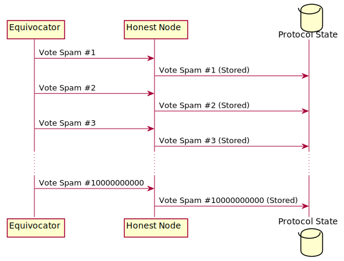
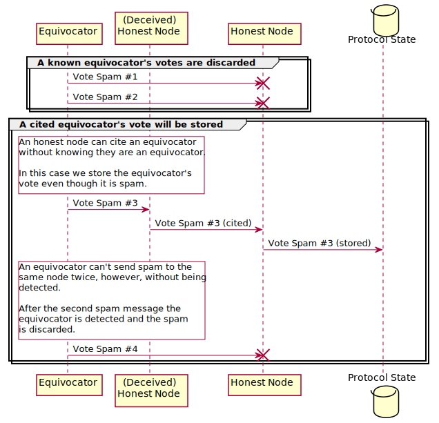

# Design: Defence Against Fork Spam

## Summary

[summary]: #summary

CEP PR: [casperlabs/ceps#19](https://github.com/casperlabs/ceps/pull/19)

This CEP addresses a *Denial of Service* vulnerability that an equivocating node may execute.  It is possible for an equivocating node to potentially spam billions of faulty votes through the gossip network.  The current implementation does not check for this. It includes potentially all votes in the protocol state regardless of whether they are equivocating. This could result in blocks that are gigabytes or terabytes in size.  We propose to discard any vote by an equivocator except if it has another node as a dependency.

[1]: https://github.com/xcthulhu/casper-node/blob/eae7c437819c1ee0f4f33e4373ff66fb5e98379a/node/src/components/consensus/highway_core/highway.rs#L195-L204
[2]: https://github.com/xcthulhu/casper-node/blob/eae7c437819c1ee0f4f33e4373ff66fb5e98379a/node/src/components/consensus/protocols/highway.rs#L379-L442

## Motivation

[motivation]: #motivation

This CEP addresses a potential security threat.  The threat is a *Denial of Service* (DOS) attack. An equivocating node could spam the network with many faulty votes.  These would result in the node producing potentially very large blocks in the current implementation.  These large blocks could stop the network from processing nodes.

## Guide-level explanation

[guide-level-explanation]: #guide-level-explanation

*Fork spam* refers to when an equivocating node broadcasts many votes over the wire to its peers.

Properly functioning nodes should not include this vote spam in the protocol state.  However, an exception is made if a spammed vote is referenced by another properly functioning node's vote.

The following UML diagram shows how an attacking equivocator will spam a node, resulting in a very large protocol state with 10000000000 votes.

After our proposed changes, an equivocator could at most once get a spammed vote included in the protocol state.  They would have to deceive an honest node.  Here is an UML diagram showing how messages will be processed:

For implementation-oriented CEPs (e.g. for node internals), this section should focus on how other developers should think about the change, and give examples of its concrete impact. For policy CEPs, this section should provide an example-driven introduction to the policy, and explain its impact in concrete terms.

## Reference-level explanation

[reference-level-explanation]: #reference-level-explanation

Votes are to be annotated with equivocators if detected in [`components::consensus::highway_core::highway::Highway::pre_validate_vertex`][1]. Then, in [`components::consensus::protocols::highway::HighwayProtocol::handle_message`][2] votes are processed as follows:

  1. If the vote is not from an equivocator, process as normal
  2. If it's from an equivocator and from the future, discard
  3. If it's from an equivocator and a (transitive) dependency of another vote, keep it
  4. Otherwise discard it

(3) captures the workflow with the deceived honest validator presented in the last section.

## Rationale and alternatives

[rationale-and-alternatives]: #rationale-and-alternatives

An alternate design would be to combine `components::consensus::highway_core::highway::Highway` and `components::consensus::protocols::highway::HighwayProtocol`.  The scope of this would be rather large.

## Unresolved questions

[unresolved-questions]: #unresolved-questions

- Do we need to block spamming equivocators using the gossip network?
