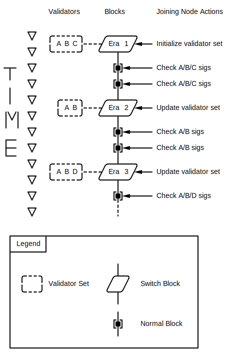

Joining Node Validator Set Tracking When Synchronizing
======================================================

Summary
-------

CEP PR:
[casperlabs/ceps\#0024](https://github.com/casperlabs/ceps/pull/0024)

A node joining the network needs a secure means of tracking the
validator set as it processes blocks. To achieve this, the validators
for the next era are to be provided in each switch block.

This is required for
[casperlabs/ceps\#0026](https://github.com/casperlabs/ceps/pull/0026).

Motivation
----------

As a node gets blocks and becomes up-to-date, it will process blocks in
ascending eras. If the node has secure knowledge of the validators in
that era it can use *finality signatures* to determine the authenticity
of block hashes. A procedure for tracking the validators for each era is
essential to securely joining the network.

Guide-level explanation
-----------------------

Joining a network requires that a node process one block at a time
(under the current scheme). It does so until it becomes current. The
node then runs the *Highway* protocol.

The following depicts the process a joining node will take assuming an
era height of 2. Checking will not be implemented until
[casperlabs/ceps\#0026](https://github.com/casperlabs/ceps/pull/0026).

As we can see above, a switch block can change the validator set.
Joining nodes needs to track this.

Reference-level explanation
---------------------------

*Synchronization mode* is mediated by the variant
[`linear_chain_sync::State::SyncingDescendants`](https://github.com/xcthulhu/casper-node/blob/0a7f9e5fd7608e2f6574c1e213bd9f5e35880af5/node/src/components/linear_chain_sync.rs#L85-L93).

We could add a field `validators` to this with type
[`types::ValidatorWeights`](https://github.com/xcthulhu/casper-node/blob/0a7f9e5fd7608e2f6574c1e213bd9f5e35880af5/types/src/auction/types.rs#L15)
(i.e. `BTreeMap<PublicKey, U512>`).

This would be updated as switch blocks are processed. To support this, a
field `next_era_validator_weights` with type `BTreeMap<PublicKey,U512>`
will be added to
[`block::BlockHeader`](https://github.com/xcthulhu/casper-node/blob/d00ab84f2501f2f65e8ab6e0a7449c0e0983138b/node/src/types/block.rs#L533).

Unresolved questions
--------------------

-   While validators are now tracked, how will blocks be checked as
    discussed in the [Guide-level
    explanation](#guide-level-explanation)? This is addressed in
    [casperlabs/ceps\#0025](https://github.com/casperlabs/ceps/pull/0025).

-   What changes need to be made to transitioning from the
    `SyncingDescendants` state to ordinary validation? This is also
    addressed in
    [casperlabs/ceps\#0025](https://github.com/casperlabs/ceps/pull/0025).

-   How will we enforce the new invariants? What is the testing
    strategy?

-   What else is needed to support fast sync?

Future possibilities
--------------------

To support fast synchronization, *booking blocks* could contain the
validator sets for future eras. This way, a node could skip from one
booking block to the next in the era where the specified validators are
activated. It would not be necessary to process the intermediate blocks.
