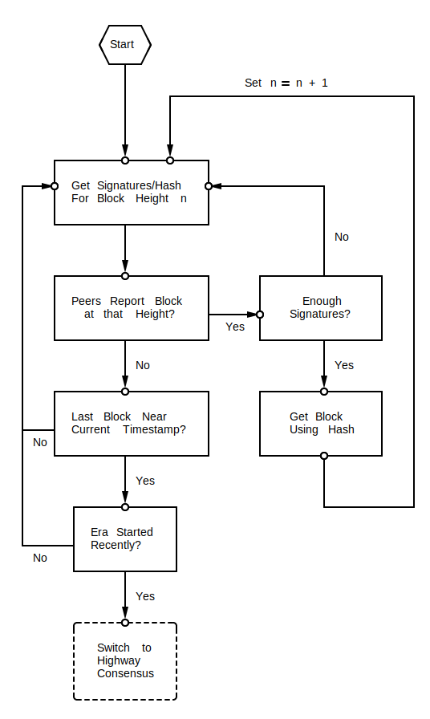

```{=org}
#+STARTUP: inlineimages
```
Finality Signatures For Secure Joining Node Synchronization
===========================================================

Summary
-------

CEP PR:
[casperlabs/ceps\#0026](https://github.com/casperlabs/ceps/pull/0026)

Nodes joining the network will use *finality signatures* to securely
synchronize with the validators. As a node synchronizes, it will get
signatures of block hashes via the gossip network until it has greater
than threshold `t%` (default: 33%) of the validator weight. Once a node
has enough signatures, it can trust that block hash. It can then proceed
to download the next block hash.

This is a follow up to
[casperlabs/ceps\#0024](https://github.com/casperlabs/ceps/pull/0024)

Motivation
----------

Nodes joining the network need to get blocks from the block-chain in a
secure manner. If a block hash has *finality signatures* from enough
validators then a node can trust it. If a node can see that greater than
`t%` of the validator weight has signed a block-hash which do not appear
to be Byzantine, then that node can trust that block hash. If it sees
more than `t%` are Byzantine it should stop the process because there\'s
been an *equivocation catastrophe* (see
[casperlabs/ceps\#0006](https://github.com/CasperLabs/ceps/blob/master/text/0006-equivocation-catastrophes.md)).
It suffices for nodes to get these signatures from the gossip network.

Guide-level explanation
-----------------------

Nodes joining the chain need to get *finality signatures* so it can
trust a block-hash. These come from the gossip network. The security
model dictates they need more than `t%` (default: 33%) of the validator
weight to establish trust. But if for more than `t%` of validators are
found to be Byzantine, the node will stop its process for emergency
restart.

This is done by asking the gossip network for a block-hash at height
`n`. There are two responses to consider:

1.  There is no block at height `n`
2.  A block hash is provided along with signatures

The diagram below provides the logic for handling these responses.



Reference-level explanation
---------------------------

The central place where program logic will change is in
[linear~chainsync~::LinearChainSync::fetch~nextblock~](https://github.com/xcthulhu/casper-node/blob/0a7f9e5fd7608e2f6574c1e213bd9f5e35880af5/node/src/components/linear_chain_sync.rs#L365-L368).

``` {.rust}
State::SyncingDescendants { .. } => {
    let next_height = block_header.height() + 1;
    fetch_block_at_height(effect_builder, peer, next_height)
}
```

Before the call to `fetch_block_by_hash`, the `LinearChainSync` process
will need to have acquired a enough weight in signatures as discussed in
*Guide-level explanation*.

Here `fetch_block_at_height` will yield the block header *and* the
finality signatures. Moreover, updating `next_height` to
`block_header.height() + 1` will happen only after enough weight of
finality signatures has been observed.

Byzantine nodes are a key concern for calculating the weight.

Nodes must deal with a faulty validator when syncing. A validator could
make finality signatures with the same height (according to the block
header) and different block hashes. An approach to deal with this is as
follows. First, introduce an enum:

``` {.rust}
enum FaultyOrFetchedFinalitySignature {
  Faulty,
  Correct(FinalitySignature)
}
```

The naming convention in this enum follow
[panorama::Observation](https://github.com/goral09/casper-node-1/blob/0bbefb1c284784f0307661cdc7c33584ffded3ce/node/src/components/consensus/highway_core/state/panorama.rs#L24-L31).

Then extend
[linear~chainsync~::State::SyncingDescendants](https://github.com/xcthulhu/casper-node/blob/0a7f9e5fd7608e2f6574c1e213bd9f5e35880af5/node/src/components/linear_chain_sync.rs#L85-L93)
with a field `validator_finality_signatures` with type
`BTreeMap<PublicKey,
FaultyOrFetched>`. Fetching validator signatures will update this map.
New signatures are either added or change old signatures to faulty if
detected.

If there are more than `t%` signatures which are `Correct`, proceed to
the next block. If there are more than `t%` which are `Faulty` (i.e.
*Byzantine*), stop the process.

Unresolved questions
--------------------

-   Where is the enum that needs to be extended so that the gossip
    protocol to support `fetch_finality_signatures_at_height`?
